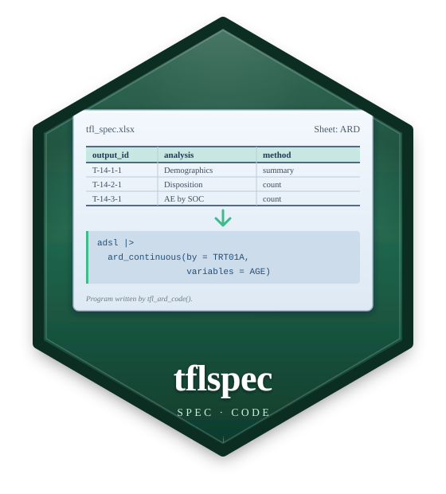

# tflspec 

[](https://www.apache.org/licenses/LICENSE-2.0)

Specifications for clinical **tables, listings and figures**, as Excel
workbooks (and YAML for figures): what is analysed, how it is laid out, how
the report is dressed. tflspec turns a spec into the object it stands for
and into the R program that makes it; [rtfreporter](https://github.com/ichirio/rtfreporter)
renders the RTF, and [tflplanner](https://github.com/ichirio/tflplanner) is
the GUI on top.

```
tflplanner   the GUI; installing it installs the other two
    |
tflspec      specs -> objects and code (needs rtfreporter, cards at run time)
    |
rtfreporter  the RTF renderer; usable on its own
```

Working with an AI assistant? Attach `tflspec_ai_manual()` (the manual of
the version you have installed) to the chat session.

Status: early development (0.0.x). Discussion and sample code:
[Discussions](https://github.com/ichirio/tflspec/discussions).

R 4.1 or later; analyses that use cardx (e.g. t-tests, confidence intervals) need R 4.2 or later.

## Concept

- **A spec becomes readable code.**  The program tflspec writes from a spec
  is short and plain, close to what a statistical programmer writes by
  hand and easy to maintain -- a program people can read, copy and finish
  by hand.
- **The typical cases, kept simple.**  The spec's columns cover the
  analyses and table layouts most studies use, so that the code written
  from them stays simple; they do not try to cover every possible design.
- **R code inside the spec.**  What the columns cannot say is written in
  the spec as R -- a condition, a derived column, an argument, a step
  after the ARD, or a whole program for a report -- and the written
  program places it where it belongs.
- **Shared setup, per-report values.**  What all reports share (header,
  footer, page style, and study information such as the company name,
  analysis type and protocol ID) is written once as setup code; each
  report's program carries only its own values.
- **Spec -> code, one way.**  The spec is the source (written by
  tflplanner or edited directly) and the program is written from it; the
  program is not edited in place.

## The one workflow

```text
ADaM ──(ARD spec)──> ARD ──(table spec)──> plan ──(report spec)──> RTF
          tfl_ard_code()      tfl_table_code()       tfl_report_code()
          tfl_build_ard()     tfl_table_plan()       tfl_report()
```

Each spec can be **run** or **written out as a program** from the same list
of steps, so the object and the program cannot disagree. The written
program is what a study keeps: it needs rtfreporter and cards, not tflspec.
What a spec makes is checked against the same thing written by hand: the
ARD value by value, a table's RTF byte by byte.

## ARD spec

A workbook of four sheets: `study` (the subject key, where the ARD goes),
`datasets` (the data and its derived columns), `populations` (the analysis
sets) and `analyses`, one cards / cardx call a row.  A *population* is what
ICH E9 and the CDISC Analysis Results Standard call an analysis set:
`tfl_ars()` writes each one as an ARS `AnalysisSet`, and an analysis's
`population_id` as its `analysisSetId`.

| output_id | analysis_id | method | dataset | population_id | by | variables | args |
|---|---|---|---|---|---|---|---|
| T-14-1-1 | AGE | continuous | | SAF | TRT01A | AGE | |
| T-14-3-1 | TEAE | hierarchical | ADAE | SAF | TRTA | AESOC \| AEDECOD | over_variables = TRUE |
| T-14-2-2 | KM | cardx::ard_survival_survfit | ADTTE | SAF | | TRTA | y = "survival::Surv(AVAL, 1 - CNSR)", times = c(30, 90) |

```r
spec <- tfl_read_ard_spec("spec/ard_spec.xlsx")
cat(tfl_ard_code(spec), sep = "\n")     # the cards / cardx program
ard  <- tfl_build_ard(spec)             # or run it: one study ARD
```

`method` is a keyword (`tfl_ard_methods()`), any `pkg::function`, or a
function of the study's own (study key `source`) -- for what cards and cardx
have no function for. `strata` and `denominator` are columns; anything else
goes in `args`, as R.

## Table spec

The table's roles and the rtfreporter plan verbs, one sheet a grain:
`tables`, `variables`, `cells`, `layout`, `columns`, `style`, `cell_styles`,
`col_header`.

```r
spec <- tfl_read_report_spec(c("report.xlsx", "tables.xlsx"), output_id = "DM")
plan <- tfl_table_plan(normalize_ard(tfl_ard_for(ard, "DM")), spec)
tfl_table_code(spec)                     # or the program: table_plan() |> plan_*()
```

A plan written in code goes back to a workbook with `tfl_as_table_spec()`,
which names what a sheet cannot carry and compares the RTF.

## Report spec

The page, the running header and footer, the titles and footnotes, a
watermark: sheets `report`, `page`, `header`, `footer`, `titles`,
`footnotes`.

```r
doc <- tfl_report(spec, content = plan)
generate_rtfreport(doc, tfl_report_path(spec), overwrite = TRUE)
tfl_report_code(spec, content = "plan")  # or the program
```

## Listing spec

Two sheets keyed by `output_id`: `listings` (the dataset, `where`, `sort`,
rows a page) and `listing_cols` (one row a printed column).

```r
spec  <- tfl_read_listing_spec("spec/listing_figure_spec.xlsx")
tfl_listing_code(spec, "L-16-2-7", datasets = catalog)   # the program
pages <- tfl_listing(adae, spec, "L-16-2-7")             # or the pages
```

`tfl_as_listing_spec()` writes a listing coded with rtfreporter back as a
spec.

## Figure design

A figure is a YAML design -- its data steps, statistics and layers -- that
`tfl_fig_design_code()` writes as a ggplot2 script depending only on dplyr
and ggplot2 (+ ggsurvfit / patchwork). Start from one of 38 templates:

```r
d <- tfl_fig_template("km_risk_table", param = "OS", group = "TRT01P")
tfl_check_fig_design(d, adam)
cat(tfl_fig_design_code(d), sep = "\n")
```

| KM with the number at risk | forest plot | mean by visit |
|---|---|---|
|  |  |  |

`tfl_fig_style()` holds every look-and-feel value of a study's figures.
The older sheet-based figure spec and its quick figures (`tfl_fig_km()`,
`tfl_fig_waterfall()`, ... `tfl_fig_catalog()`) remain while the
development team decides between the two
([Discussion #63](https://github.com/ichirio/tflspec/discussions/63)).

## CDISC ARS

The ARD spec as CDISC's Analysis Results Standard, and back:

```r
ars <- tfl_ars(ard_spec, table_spec, report_spec)
tfl_write_ars_json(ars, "ars.json"); tfl_check_ars(ars)
tfl_ars_to_specs(tfl_read_ars_json("theirs.json"))   # anyone's ARS as specs
```

## Column names

Table, listing and report columns are rtfreporter's argument names (a
`layout` column is the verb's prefix and its argument: `pages_max_rows` is
`plan_paginate_rows(max_rows = )`); ARD columns are cards' (`by`,
`variables`, `strata`, `denominator`), with two exceptions: `statistics`
(cards' `statistic`) and `formats` (tflspec's own). A column whose value
has a unit says it (`_twips`, `_in`, `_half_points`; `rel_width` is a
relative width). One argument is written in one place: a column, or
`args`, never both. Every column is described on its header cell's comment
and by `tfl_spec_columns()`.

## Citation

If tflspec helps your work, please cite it with `citation("tflspec")`. The
statistics of the tables come from [cards](https://pharmaverse.github.io/cards/)
and [cardx](https://insightsengineering.github.io/cardx/); please cite those
too (`citation("cards")`, `citation("cardx")`).

## Acknowledgements

tflspec stands on the work of many others, and we are grateful to their
authors.

- **[cards](https://pharmaverse.github.io/cards/) and
  [cardx](https://insightsengineering.github.io/cardx/)**: the analysis
  results data (ARD) that every ARD spec is written for, an outcome of the
  [pharmaverse](https://pharmaverse.org/) community's work on analysis results
  data.
- **[ggplot2](https://ggplot2.tidyverse.org/)** and its extensions
  ([ggsurvfit](https://www.danieldsjoberg.com/ggsurvfit/),
  [patchwork](https://patchwork.data-imaginist.com) and others): the figure
  code tflspec writes is their code.
- **[CDISC](https://www.cdisc.org/)**: the Analysis Results Standard, whose
  JSON Schema is included unchanged (`inst/ars/`, MIT; see `inst/COPYRIGHTS`),
  and **[siera](https://clymbclinical.github.io/siera/)**, which reads ARS.
- **[pharmaverseadam](https://pharmaverse.github.io/pharmaverseadam/)**: the
  ADaM data (from the CDISC pilot study) of the examples.

tflspec is an independent project and is not affiliated with, or endorsed by,
the authors of these packages or CDISC.

## License

Apache License 2.0 © 2026 Yoichi Masui. See [LICENSE.md](LICENSE.md). The
CDISC ARS JSON Schema in `inst/ars/` keeps its own MIT licence (see
`inst/COPYRIGHTS`).
